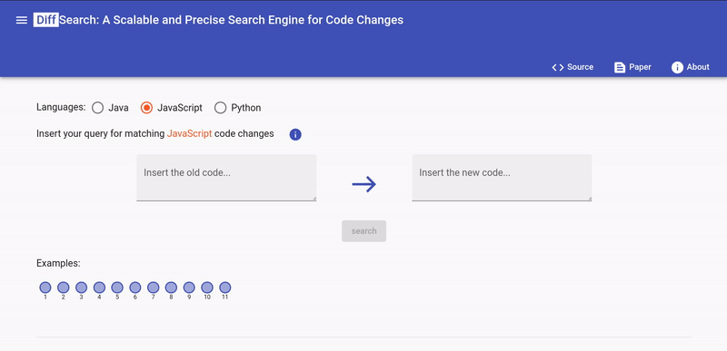
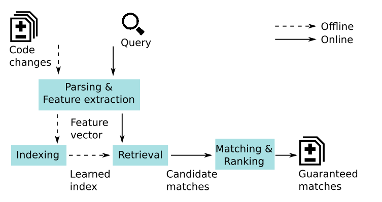

The source code of successful projects is evolving all the time,
resulting in hundreds of thousands of code changes stored in source
code repositories. This wealth of data can be useful, e.g., to find
changes similar to a planned code change or examples of recurring
code improvements. However, searching for specific kinds of code
changes across a large number of code repositories is non-trivial.

This paper presents DiffSearch, the first scalable and precise search
engine for code changes. The demo of the tool is [online](http://129.69.217.114/diffsearch).

Given a query that describes possibly abstracted versions of a code snippet before and after a change, the
approach returns a set of changes that are guaranteed to match the
query. To ensure scalability, DiffSearch indexes code changes in a
one-time preprocessing step, mapping them into a feature space,
and then performs an efficient search in the feature space for each
query. The approach is designed in a mostly language-agnostic way,
and we present implementations for Java, JavaScript, and Python.

## Syntax and Semantics of Queries

Queries are formulated in an extension of Java. The structure of a query is the following:

                                 old code --> new code

Here’s an example query:

                                 x = foo(); --> x = bar();
                                 
Queries are compared against the **lines changed in a commit**, by checking that everything in
the query indeed appears in the commit. If a commit changes more than what is asked for in a
query, then this commit counts as a match. In contrast, if a query contains code not among the
changed lines, it’ll not match. For example, the above query will match

                               x = foo(); y = z; --> x = bar(); z = y;
                               
but it won’t match the following:

                                     foo(); --> x = bar();

The syntax of queries follows the Java language and also allows for some **syntactically
incomplete code snippets**. For example, a query may open a block with “{“ but not close it with
a matching “}”.

In addition to the syntax of the target programming language, queries support some special
symbols (note: the symbols are case-sensitive):

**LT** which matches any literal, e.g., a number, a char, or a string
**ID** which matches any identifier, e.g., a variable name or method name
**EXPR** which matches any expression, e.g., x < y + 1 or x.foo
**binOP** which matches any binary operator, e.g., + and -
**unOP** which matches any unary operator, e.g., ++ and --
**OP** which matches any assign operator, e.g., = , -=, and +=

These symbols can also be **labeled with a number** (0 to 3) to match the same syntactic
element multiple times, e.g., ID<1> and LT<2>. For example, this query searches for code
changes where the binary operands inside an if condition changes:

                      if (ID<0> binOP LT<0>) { --> if (ID<0> binOP LT<0>) {

The query matches this code change:

                                   if (x > 0) { --> if (x < 0) {

But not this one (because x changes to y):

                                   if (x > 0) { --> if (y < 0) {

Another special symbol is ​ _ ​ , which indicates that one part of the code change is **empty**. It is
useful for finding inserted and deleted code. For example, the following query looks for an
inserted return statement:

                                           _ --> return EXPR;

There is a last special symbol, ​ <...>​ , which represents a **wildcard**. It matches zero, one, or more
statements or expressions and helps with queries where some other code may be interspersed
between the code to find. For example, the following query searches for any code change that
replaces some (potentially empty) code with a return statement that returns a variable:

                                            <...> --> return ID;

## Examples of Queries and Matching Code Changes

Query A:    
               	
               	       <...>                      <...>
                           ID<0>();                   ID<1>();
                           <...>         	-->       <...>
                           ID<0>();                	  ID<1>();
               	 
Matching change A:   
    
                           g();              	   g();
                           f();                        z();
                           h();    		-->        h();
                           j();                        j();
                           f(); }                	   z();

Query B:     
               	
               	       <...> 		         try {
                                                           <...>
                                            -->      } catch (ID ID) {
                                                           <...> }

Matching change B: 	

                           x=3; 		  	try {
                                            -->          x=3;
                                                    } catch (Exception e) {
                                                         System.out.println("oops");}

Query C:                  
  	
  	                      <...>
                          ID = 23;   	 -->  	<...>
                          <...>

Matching change C: 	

                            a=2;             		a=2;
                            b=5;             		b=5;
                            c=7;    	  -->	        c=7;
                            d=23;           		d=23;
                            e=1;             		e=1;
                            f=2;              		f=2;

More DiffSearch queries are in our dedicated [Wiki page](https://github.com/lucaresearch/DiffSearch/wiki/Good-queries-for-demonstration)
      

## Requirements
- Java 11 and Python 3.7
- Linux Operating System
- [ANTLR 4](https://github.com/antlr/antlr4/blob/master/doc/getting-started.md) -> apt install antlr

## How to run

FOR THE DIFFSEARCH SERVER:

  - Install:
      - chmod 754 installDiffSearch.sh
      - sed -i -e 's/\r$//' installDiffSearch.sh
      - ./installDiffSearch.sh

  - Run:   
      - mvn compile  
      - mvn exec:java -Dexec.mainClass=research.diffsearch.main.App -Dexec.args="-g -lang java"

  - Extra:
      
      - If you received the error: " OSError: [Errno 98] Address already in use"
        - Use the following commands:
          - fuser -k 5002/tcp
          - fuser -k 8843/tcp
          
  - More DiffSearch arguments are in our [Wiki page](https://github.com/lucaresearch/DiffSearch/wiki/Commandline-Parameters)
        

FOR THE GUI:

- clone the repository: https://github.com/sola-st/DiffSearch-UI
- Run the command: ng serve --proxy-config src/proxy.conf.json
- Go in "http://localhost:4200/diffsearch" with your browser 
